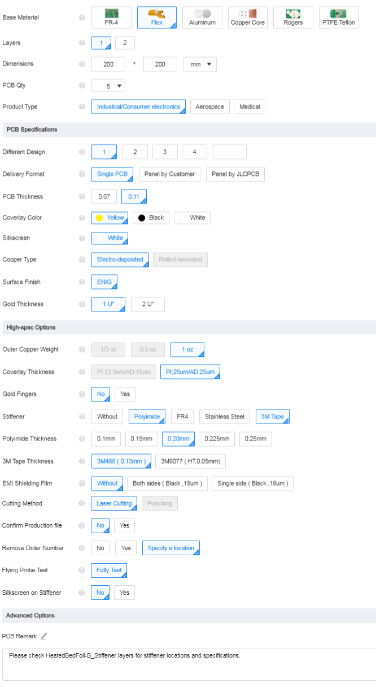

**NOTE: This design is currently in testing.**  
If you are interested in a custom bed heater, then please join our Discord server to see if there are any extra ones available, or if there is an upcoming group buy.
   

**PCB**

- Flex Polyimide Base - as lightweight as possible
- Copper Thickness: 1oz (35 µm)
- 3M468MP backside adhesive
- Silkscreen: White

 

**Power** 

- Voltage:  24V DC
- Resistance: 2.66 Ohm @ 25C (Please see the included Excel screenshot for calculations)
- Power: 216W @ 25C

 
**Thermistor** 
- NTC 100K 3950
   

**Power Cable**

 - 16 AWG Multi-strand Soft Electrical Silicone Cable
 - No connector, tinned wires
 - Length: 70cm

 
**Thermistor Cable**

- Preferred thin PTFE Wire around ~26 AWG
- 2 pin JST XH 2.54 female connector  
 

>For optimizing your own heater wattage you can use the following calculator. Start with a Trace Width: 2.4mm, Lenght: 13355mm, Thickness: 1oz,   
>https://www.allaboutcircuits.com/tools/trace-resistance-calculator/  

 

>Designed with the help of [Róbert Lőrincz](https://www.orbiterprojects.com/)  
>[Story Of The Orbitron Heated Bed Design](https://www.orbiterprojects.com/stories/story-of-the-orbitron-heated-bed-design/) 

   

**JLCPCB**

- Upload HeatedBedFoil_FS_GBR.zip and set the following specifications

