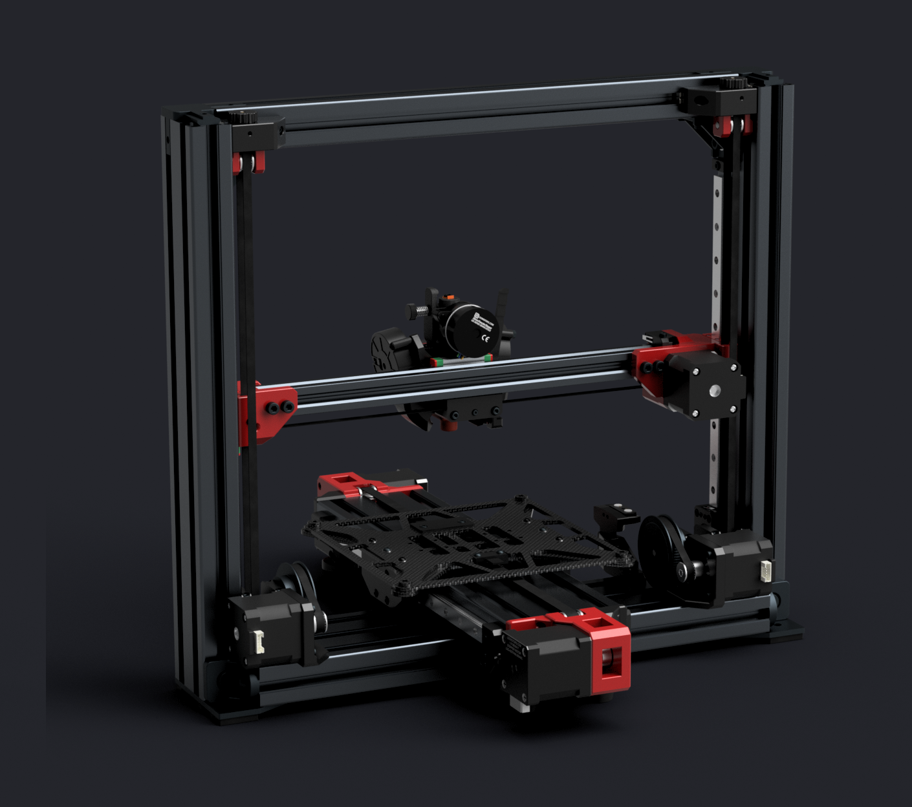

# LH Stinger
Status: **Beta Testing** 

 
   > *A no compromise cartesian 3D Printer designed for speed and precision.*

 

 [BOM / Sourcing Guide](https://docs.google.com/spreadsheets/d/1s8ulLfThmbuy1G_40MvkXXL2oVx9PZhvpAY9hMxqYbg/edit?usp=drive_link)

## Features

- Lightweight bed carriage assembly with carbon fiber components
- Cross Frame design focused on stiffness and stability
- Low center of gravity
- AWD stepper configuration for the Y-axis
- 235 mm^2 x 200mm maximum build volume (easily expandable to other sizes)
    - 200 mm^2 carbon fiber bed for high-speed setup
- Optimized for daily print speeds of 400-600 mm/s with 20.000 mm/s^2 acceleration
- Motion system capable of 1.000 mm/s speed with 100.000 mm/s^2 acceleration
- Maximum volumetric flow rate: ~ 49 mm^3/s
- Build using 30 series T-slot extrusion with parts up to 3090
- All bracket assembly
- Genuine high-quality motion system components
- All motion based on MGN12H Rails with high preload
- Fully belt-driven with minimal belt paths
- 9mm 2GT belt in symmetrical configuration for Y-axis
- 6mm 2GT belts for the rest of the axis
- Independent Z stepper motors with Z Tilt capability for the X-axis
- Lightweight dual plate carbon fiber bed carriage with integrated tensioner and compatible with different bed sizes
- Rigid bed mount
- Bearing supported stepper shafts in double shear mounts on the Y-axis 
- High torque LDO-42STH48-2504AC stepper motors running on 36V for the X and Y-axis
- Dual power supply supporting 24V and 36V power standards (easily configurable for 48V)
- Driven by the Octopus Pro 1.1 board with TMC2240 drivers
- Running [Klipper](https://github.com/Klipper3d/klipper) firmware
- Easily serviceable external electronic box with good airflow, and support for multiple power supplies and configurations.
- Good cable management
- Toolhead based on the Dragon HF and HF extender
  - Custom silicon sock mold available for RTV casting
- LDO Orbiter 2.0 direct drive extruder
- Dual 5015 fan setup for part cooling
- Adopts the [Annex Engineering Quickdraw Probe](https://github.com/Annex-Engineering/Quickdraw_Probe)
- Minimalistic part design focused on strength and easy printability
- Printed in ASA
- Easily enclosed, with the main electronic components outside of the build chamber.
    - The 200 mm^2 bed configuration ca be fully enclose up to the frame bounding box, with no extra space needed for the bed.
  
 
 

**Resonance Tests** 
 
 

## Credits

_Inspired by the [Annex Engineering](https://github.com/Annex-Engineering) team and [community](https://discord.com/invite/MzTR3zE), alongside the  [Klipper community](https://discord.klipper3d.org) and all the crazy people that continue to push bed slingers to the limits. :purple_heart:_

_-Toolhead evolved from an amazing design by [Dalegaard](https://github.com/dalegaard) 
-Silicon sock mold based on [Renátó Kulman](https://www.printables.com/@RenatoKulman) 
-Wago 221 mounts by [fns720](https://www.printables.com/@fns720) 
-SSR protection cover based on [Technoturk](https://www.printables.com/@Technoturk_377911) 
-3030 extrusion Cable clip based on [Arthur_C](https://www.printables.com/@Arthur_C_428094) 
-3030 t-nut clip based on [John_S](https://www.printables.com/@JohnS) _
