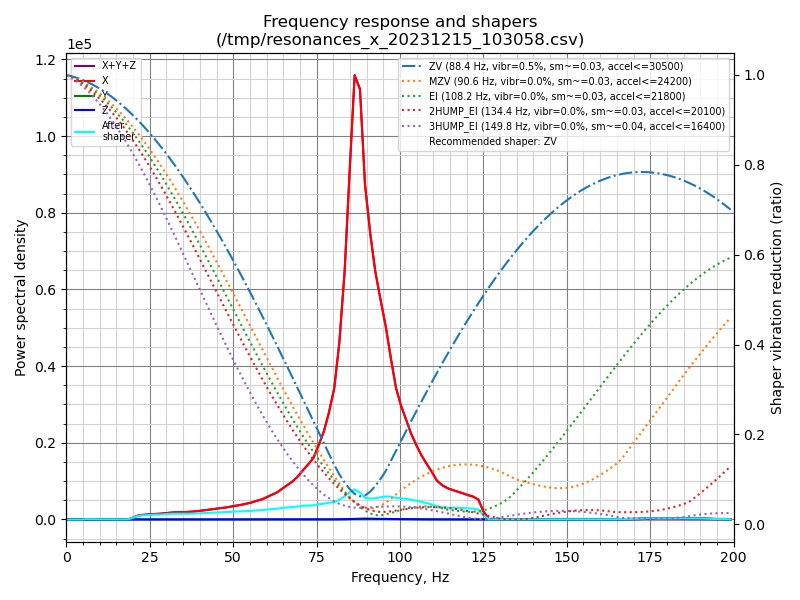
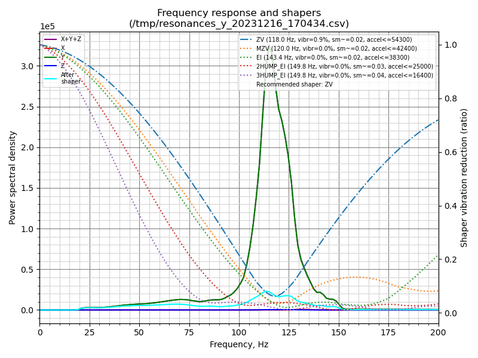

[![CC BY-NC-SA 4.0][cc-by-nc-sa-shield]][cc-by-nc-sa]

[cc-by-nc-sa]: http://creativecommons.org/licenses/by-nc-sa/4.0/
[cc-by-nc-sa-image]: https://licensebuttons.net/l/by-nc-sa/4.0/88x31.png
[cc-by-nc-sa-shield]: https://img.shields.io/badge/License-CC%20BY--NC--SA%204.0-lightgrey.svg

# LH Stinger

Status: **Feature Complete - Beta Testing - V1.0 Beta 2 In Progress**

> _LH Stinger is a no-compromise cartesian 3D Printer designed for speed and precision._  
> _It is created as a long-lasting platform for those who like to push quality or speed to the extreme._  
> _The project intends to become a community-driven project, not a brand._  

 

  

 

**Contents:**
<!--ts-->

- [LH Stinger](#lh-stinger)
  - [Resources](#resources)
  - [Features](#features)
  - [Assembly Instructions](#assembly-instructions)
  - [Contact](#contact)
  - [To Do](#to-do)
  - [Credits](#credits)
  - [Support](#support)
  - [License](#license)

 

## Resources
 

- [BOM / Parts List / Sourcing Guide](https://docs.google.com/spreadsheets/d/1s8ulLfThmbuy1G_40MvkXXL2oVx9PZhvpAY9hMxqYbg/edit?usp=drive_link)  
- [STL Files and Printing Instructions](STL/)  
- [CAD Source Files ](CAD/)
- [Klipper Configuration ](Config/Klipper_Config) 
- [Wiki / Assembly Guide](https://github.com/lhndo/LH-Stinger/wiki/Assembly-Guide) (In Progress)
- [Build Log / Media](https://github.com/lhndo/LH-Stinger/wiki/Build-Log)
- [Videos](https://www.youtube.com/channel/UCPD2Ai4b49gVoCFSGFWoSdw) 

 

## Features
 

- Lightweight bed carriage assembly with carbon fiber components
- Cross Frame design focused on stiffness and stability
- Low center of gravity
- AWD stepper configuration for the Y-axis
  - Optional conversion for X-axis AWD setup
- 235 mm^2 x 200mm maximum build volume (easily expandable to other sizes)
  - 200 mm^2 carbon fiber bed for high-speed setup
  - 235 mm^2 aluminium bed for a larger volume
- Optimized for daily print speeds of 400-600 mm/s with 20.000 mm/s^2 acceleration ([Test A](https://www.youtube.com/watch?v=bxNQv3xVFXA&)) ([Test B](https://www.youtube.com/watch?v=mh0rmYptH-0)) ([Test C](https://www.youtube.com/watch?v=cDipS-Msi5c))
- Motion system capable of 1.000 mm/s speed with 100.000 mm/s^2 acceleration ([Test](https://www.youtube.com/watch?v=Xajs2mky6ZU))
- Maximum volumetric flow rate: ~55-60 mm^3/s ([Test](https://www.youtube.com/watch?v=K3M1EXKJzKs))
- Built using 30 series T-slotted extrusions with parts up to 3090
- All bracket assembly
- Genuine high-quality motion system components
- Entire motion system based on high preload MGN12H linear guide rails
- Fully belt-driven with minimal belt paths
- 9mm 2GT belt in symmetrical configuration for the Y-axis
- 6mm 2GT belts for the rest of the axis
- Independent Z stepper motors with Z Tilt capability for the X-axis
- Lightweight dual plate carbon fiber bed carriage with integrated tensioner and compatible with different bed sizes and carriage configurations
- Rigid bed mount
- Bearing supported Y-axis stepper motor shafts in double shear mounts
- High torque LDO-42STH48-2504AC stepper motors supplied with 36V for the X and Y-axis
- Dual power supply supporting 24V and 36V power standards (easily configurable for 48V)
- Driven by the Octopus Pro 1.1 board with TMC2240 drivers
- Running [Klipper](https://github.com/Klipper3d/klipper) firmware
- Easily serviceable external electronic box with good airflow, and support for multiple power supplies, SSRs, RPi and large controller boards.
- Good cable management with a quick disconnect system between the printer and ebox
- Toolhead based on the Dragon HF hotend and HF extender
  - Custom thick silicon sock mold available for RTV casting
- LDO Orbiter 2.0 direct drive extruder
- Dual 5015 fan setup for part cooling
- Adopts the [Annex Engineering Quickdraw Probe](https://github.com/Annex-Engineering/Quickdraw_Probe)
- Minimalistic printed parts design focused on strength and easy printability
- Printed in ASA, providing high temperature resistance
- Easily enclosed, with the main electronic components outside of the build chamber.
  - The 200 mm^2 bed configuration can be fully enclose up to the frame bounding box. No extra space is needed for the bed movement.

 

**Resonance Tests:** 
 
 

 

## Assembly Instructions 

Please consult the [CAD Source Files ](CAD/)  for assembly instructions, and the following [Wiki](https://github.com/lhndo/LH-Stinger/wiki) pages:  
> [Build Log](https://github.com/lhndo/LH-Stinger/wiki/Build-Log)  
> [Wiki / Assembly Guide](https://github.com/lhndo/LH-Stinger/wiki/Assembly-Guide)  (In Progress)  

 For support please join us on the [LH Stinger Discord](https://discord.gg/rMXefNcx))
 

## Contact

lemurshaze @ gmail.com  

@LH on [LH Stinger Discord](https://discord.gg/rMXefNcx)  

 

## To Do 

- Custom [Polyimide Heater Flex PCB](PCB/PI%20Bed%20Heater%20-%20200mm) (In progress)
- Breakout PCB and Wire Harness  
- Documentation and [Assembly Guide](https://github.com/lhndo/LH-Stinger/wiki/Assembly-Guide) (In progress)
- Polycarbonate EBox design
- Lightweight Toolhead based on 2510 and 3515 Delta axials 

 

## Credits

_Inspired by the [Annex Engineering](https://github.com/Annex-Engineering) team and [community](https://discord.com/invite/MzTR3zE), along with the [Klipper community](https://discord.klipper3d.org), [RatRig](https://ratrig.com/) and all the crazy people that continue to push bed slingers to the limits. :purple_heart:_

-Toolhead evolved from an amazing design by [Dalegaard](https://github.com/dalegaard) 
-Silicon sock mold based on [Renátó Kulman](https://www.printables.com/@RenatoKulman) 
-Wago 221 mounts by [fns720](https://www.printables.com/@fns720) 
-SSR protection cover based on [Technoturk](https://www.printables.com/@Technoturk_377911) 
-3030 extrusion Cable clip based on [Arthur_C](https://www.printables.com/@Arthur_C_428094) 
-3030 t-nut clip based on [John_S](https://www.printables.com/@JohnS) 
 

## Support

<a href='https://ko-fi.com/lh_eng' target='_blank'>   

## License

This work is licensed under a [Creative Commons (4.0 International License)  ](https://creativecommons.org/licenses/by-nc-sa/4.0/)  
[**Attribution—Noncommercial—Share Alike**](LICENSE.md)  
 
  
 
